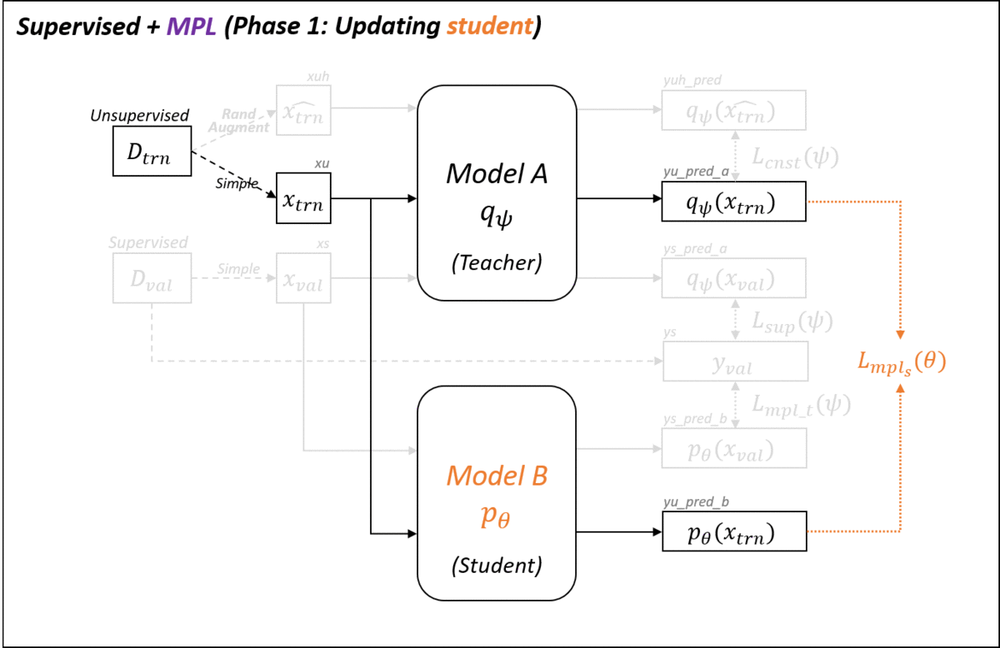

# Meta Pseudo Labels
A PyTorch implementation of [Meta Pseudo Labels](https://arxiv.org/abs/2003.10580).

## Environments
* Python 3
* PyTorch 1.5
* Tensorboard
* Scipy
* [DotMap](https://github.com/drgrib/dotmap)
* [pytorch-gradual-warmup-lr](https://github.com/ildoonet/pytorch-gradual-warmup-lr)

## How to Run
```
$ python main.py --config ./config/<config_file_name> --tag <save_path>
```

## Implementation Overview
To see still images, you can refer to [implement.md](./implement.md).
### Baselines


### Baselines + MPL


### Two Phases Training of MPL


## Result (in progress)
### CIFAR-10 / WResNet 28x2  
| WResNet 28x2          | Paper (top-1)         | Our (top-1)           |
|-----------------------|----------------------:|----------------------:|
| Supervised            | 82.14 &plusmn; 0.25   |                       |
| Label Smoothing       | 82.21 &plusmn; 0.18   |                       |
| Supervised + **MPL**  | 83.71 &plusmn; 0.21   |                       |
| RandAugment           | 85.53 &plusmn; 0.25   |                       |
| RandAugment + **MPL** | 87.55 &plusmn; 0.14   |                       |
| UDA                   | 94.53 &plusmn; 0.18   |                       |
| UDA + **MPL**         | 96.11 &plusmn; 0.07   |                       |
