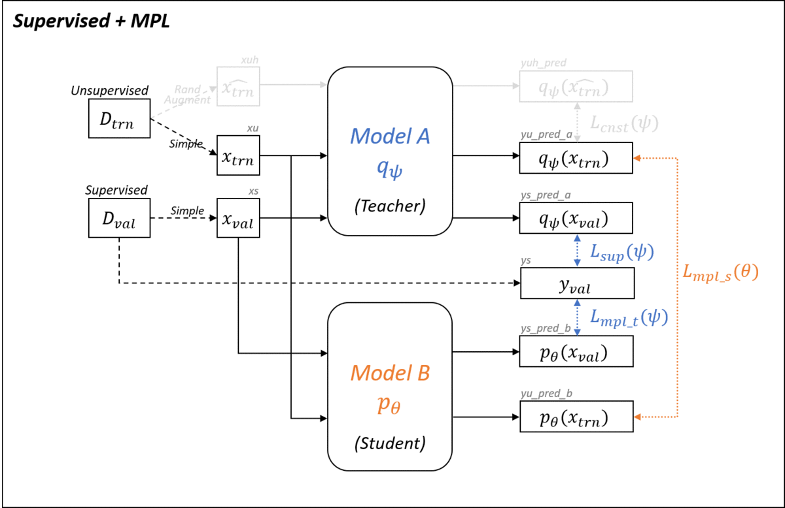

# Meta Pseudo Labels
A PyTorch implementation of [Meta Pseudo Labels](https://arxiv.org/abs/2003.10580).

## Overview
The code reproduces semi-supervised learning results in **Table 1** represented in the paper.
* Dataset: Reduced CIFAR-10
* Architecture: Wide ResNet 28x2
* Baselines:
    * `sup`: Supervised learning (+ label smoothing) trained only on labeled data
    * `ra` : [RandAugment](https://arxiv.org/abs/1909.13719) trained only on labeled data
    * `uda`: [UDA (Unsupervised Data Augmentation)](https://arxiv.org/abs/1904.12848) trained on labled & unlabeled data
* All the baselines can be compatibly trained with MPL(Meta Pseudo Labels).

## Requirements
Run the following command to install depedencies:
```
pip install -r requirements.txt
```
* Python 3 / PyTorch 1.5 / Tensorboard / Scipy
* [DotMap](https://github.com/drgrib/dotmap)
* [pytorch-gradual-warmup-lr](https://github.com/ildoonet/pytorch-gradual-warmup-lr)
* [ray](https://github.com/ray-project/ray) (+[TensorboardX](https://github.com/lanpa/tensorboardX); optional)
* [bayesian_optimization](https://github.com/fmfn/BayesianOptimization)
* (Optional) torchviz / py3nvml

## How to Run
Note that you must provide the location of a configuration file(.yaml) with `--config` flag. See the examples in `./config`. The argument `--default_config` is set to `./config/000_default.yaml` by default and the settings from `--config` file will be overwritten upon it.

In addition, provide both or either of `--tag` and `--autotag` arguments for saving models and results, unless you want everything to be volatile for debugging purpose.

### Training with automatic tagging
`save_dir`: {out_dir}/{date}/{yaml_filename_without_extension}_{counter}
```
$ python main.py --autotag --config ./config/080_cifar10_uda_mpl.yaml
# e.g. for the first trial: out/0527/080_cifar10_uda_mpl_000
```
The suffixed counter will be automatically increased if `save_dir` already exists.

### Training with manual tagging
You can manually add a postfix to the auto-tagged `save_dir`.
```
$ python main.py --autotag --config ./config/080_cifar10_uda_mpl.yaml --tag xxx
# e.g. for the first trial: out/0527/080_cifar10_uda_mpl_factor_xxx
```
Or just you can set your own path without `--autotag`.
```
$ python main.py --config ./config/080_cifar10_uda_mpl.yaml --tag any/where/you/want
# e.g. for the first trial: out/any/where/you/want
```
### Saving and Restoring
For fault tolerance, traning can be resumed from its lastest checkpoint given the same tag to the interrupted one. (Warning: there is a problem that have not yet resolved in restoring [gradual warmup scheduler](https://github.com/ildoonet/pytorch-gradual-warmup-lr))

### Evaluation
```
$ python main.py --save_dir out --tag 0527/080_cifar10_uda_mpl_000 --test_only
```
You can omit `--save_dir` if you have stored checkpoints in the default dir: `out`

## Features
### Gradient-of-gradient Traceable Module Parameters
With the standard PyTorch APIs, model parameters cannot keep track of `grad_fn` since `torch.nn.Parameter` is not meant to be a non-leaf tensor. One could be able to build models with normal tensors and functions in `torch.nn.functional` with one's own hands, yet it might be quite painful when their complexities are large enough. To bypass this, we use a simple trick where `torch.nn.Parameter` of the module is switched over to `torch.Tensor`. Thus, it can retain computational graphs for second order gradients while not losing compatibility with `torch.nn.Module`.

### Module Optimizer
We cannot use subclasses of `torch.optim.Opimizer` along with the trick aforementioned for two reasons: 1) they cannot build graphs of 'gradient descent of gradient descent' since `.step()` is decorated with `torch.no_grad()`, 2) even if they could, they keep references of given parameters and update them with in-place assignments, which hinders second order graph building as well. To tackle issue, we use novel optimizers that posses the references of modules so that it directly modify the parameters without relying on in-place operation.
```Python
from optim.sgd import SGD
optim = SGD([{'module': model.base},
             {'module': model.classifier, 'lr': 1e-3}
            ], lr=1e-2, momentum=0.9)
```

### Preprocessing RandAugment in UDA
By setting `uda.preproc_epochs` to an integer larger than 0 in the .yaml configuration file, you can simulate the RandAugment results during that amount of epochs and save them in the disk. Multiple number of workers specified by `uda.preproc_workers` will pay all the cost in advance instead of amortizing it at each instance sampling. (Yet, no speed gain probably from slow file I/O in HDD.)

### Hyperparameter Tunning using RAY
You can run hyperparameter tuning with the command:
```
$ python tune.py --autotag --config ./config/080_cifar10_uda_mpl.yaml
```
The result will be saved via a file stream if you specified any type of tags. The constraints of the search algorithm has to be set in the .yaml configuration file under the key `tune`. We use [Ray framework](https://github.com/ray-project/ray) under the hood with Bayesian search algorithm and Asyncronous HyperBand scheduler. See the [Ray documentation](https://docs.ray.io/en/master/) for details.

### GPU Profiling
This project includes a GPU memory profiler for debugging OOM problems.
If you assign a GPU ID to the environment variable `$(DEBUG_DEVICE)`, the model will be uploaded to that GPU while tracking its usuage throughout the iterations.
```
$ DEBUG_DEVICE=0 python train.py --config ./config/080_cifar10_uda_mpl.yaml
```
It is recommended to consider [pytorch_memlab](https://github.com/Stonesjtu/pytorch_memlab/blob/master/README.md) for the same purpose.
#### Global Trace
```python
from gpu_profile import GPUProfiler

gpu_profiler = GPUProfiler.instance(
  gpu_id=int(os.environ['DEBUG_DEVICE']),
  tensor_sizes=False,   # shows new and deleted tensor
  ignore_external=True, # ignore trace calls from out of the project
  show_diff_only=True,  # print only when memory ususage differs
  console_out=True,     # activate console output besides the default file logging.
  white_list=['optim.units'],  # restrict the scope into {module_name}.{function_name}
  black_list=['optim.units.test'],   # the ones you want to exclude from the scope
  info_arg_names=['step', 'n'],      # local variables you want to check
  condition={'step': lambda step: step == 2},  # additional break condition
  )
gpu_profiler.global_set_trace()
```
#### Local Trace
```python
# other_module.py
import get_data, model, criterion
from gpu_profile import GPUProfiler

x = get_data()
# GPUProfiler is a singleton class   
# that can be called globally after once being initialized
with GPUProfiler.get_instance():
    y = model(x)
loss = criterion(y_pred, y)
```

## Implementation Details
To see still images, you can refer to [implement.md](./implement.md).
### Baselines


To minimize duplicated code lines, baselines are implemented in a way where they share pipelines with others as much as possible. Basically, there exists two model templates which is represented as `model A` and `model B`, which can be alternatively replaced by 'student' or 'teacher' in MPL.  Baseline models take the place of `model A` and can be considered as stand-alone **student** model. This design choice was made to ease the reproduction of their incremental hyperparameter search scheme described in the parer.

### Baselines + MPL


When MPL comes on the stage, you `model A` who was previously taking a role of a student will now be the teacher while keeping the same augmentation pipelines tagged along with it. Then `model B` will be the new student who never sees the labeled data but only the guides the teacher offers. Note that you always evaluate the student after the training ends regardless of whether its MPL or non-MPL model.

### Two Phases Training of MPL


At each training step, in turn, we train student and teacher as described in the paper. The only thing we have to take caution is that when student is updated according to the guidance of the teacher, it has to create computational graphs of that updating operation, which is not the case in general, in preparation for backpropagating the signal down to the teacher afterwards.

## Result (in progress)
### CIFAR-10 / WResNet 28x2  
| WResNet 28x2          | Paper (top-1)         | Our (top-1)           |
|-----------------------|----------------------:|----------------------:|
| Supervised            | 82.14 &plusmn; 0.25   | 81.22%                |
| Label Smoothing       | 82.21 &plusmn; 0.18   |                       |
| Supervised + **MPL**  | 83.71 &plusmn; 0.21   | 82.63%                |
| RandAugment           | 85.53 &plusmn; 0.25   |                       |
| RandAugment + **MPL** | 87.55 &plusmn; 0.14   |                       |
| UDA                   | 94.53 &plusmn; 0.18   |                       |
| UDA + **MPL**         | 96.11 &plusmn; 0.07   |                       |
