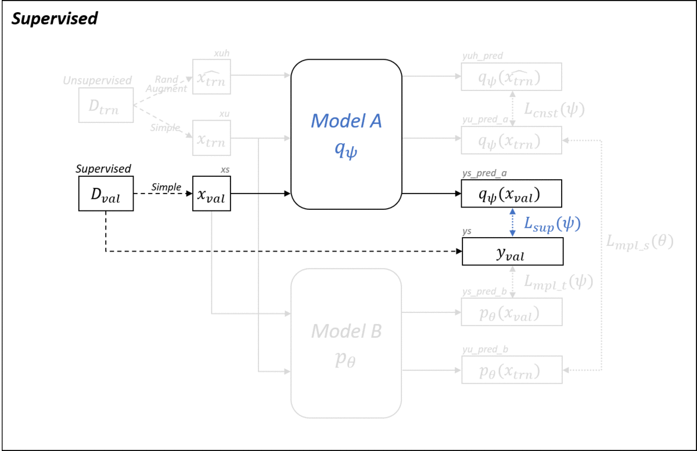
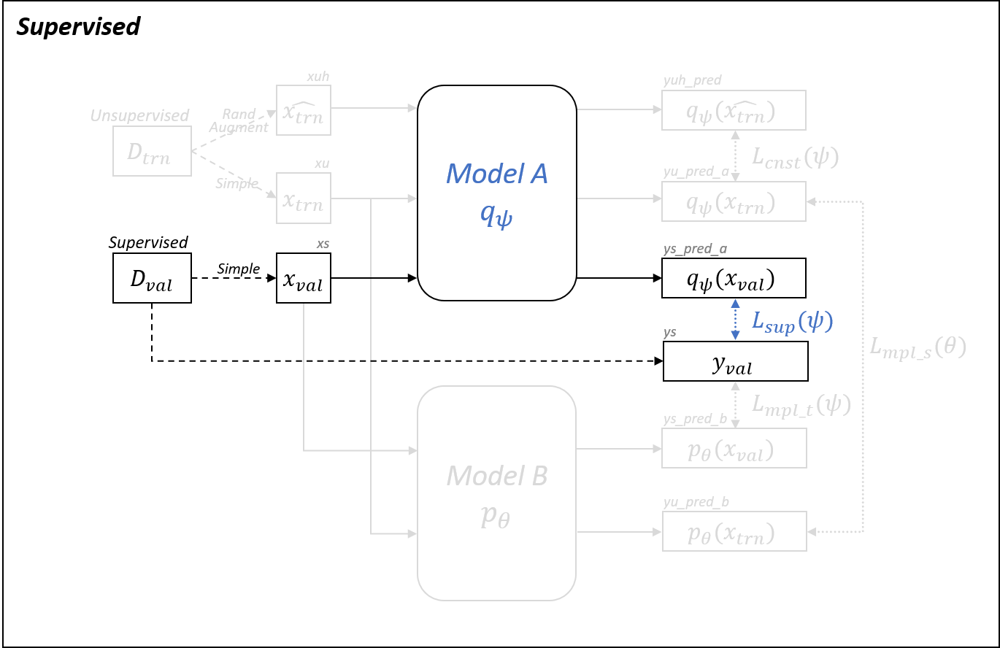
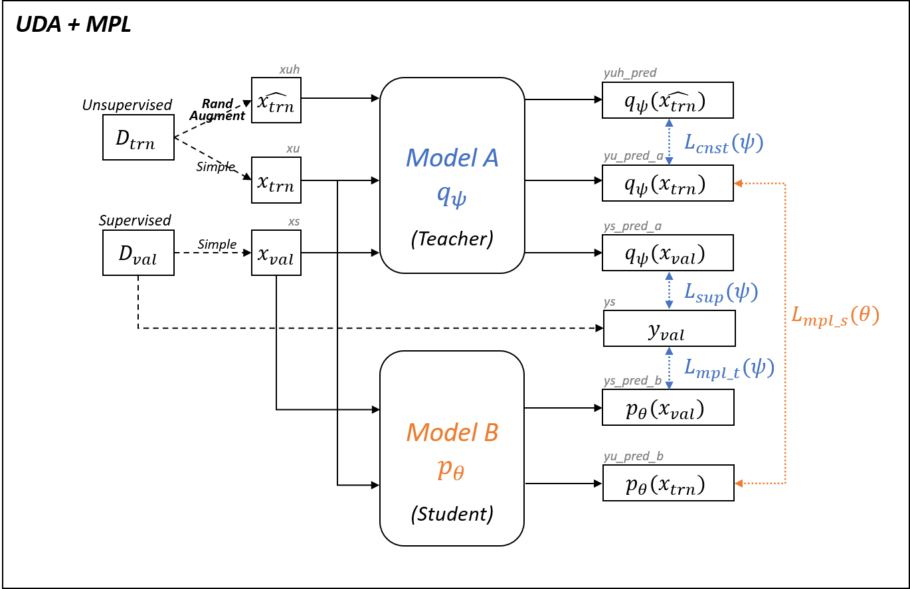

# Implementation Details

## Baselines

### Supervised

### Label Smoothing

### RandAugment

### UDA

## Baseline + MPL

### Supervised + MPL

### RandAugment + MPL

### UDA + MPL

## Two Phases Training of MPL

### Phase 1: Updating Student (Supervised + MPL)

### Phase 2-A: Updating Teacher (Supervised + MPL)

### Phase 2-B: Updating Teacher (UDA + MPL)

