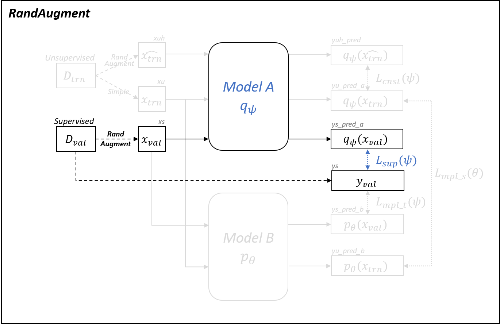

# Implementation Details

## Baselines
{: width="60%" height="60%"}
### Supervised
{: width="60%" height="60%"}
### Label Smoothing
{: width="60%" height="60%"}
### RandAugment
{: width="60%" height="60%"}
### UDA
{: width="60%" height="60%"}

## Baseline + MPL
{: width="60%" height="60%"}
### Supervised + MPL
{: width="60%" height="60%"}
### RandAugment + MPL
{: width="60%" height="60%"}
### UDA + MPL
{: width="60%" height="60%"}

## Two Phases Traing of MPL
{: width="60%" height="60%"}
### Phase 1: Updating Student (Supervised + MLP)
{: width="60%" height="60%"}
### Phase 2-1: Updating Teacher (Supervised + MLP)
{: width="60%" height="60%"}
### Phase 2-2: Updating Teacher (UDA + MLP)
{: width="60%" height="60%"}
